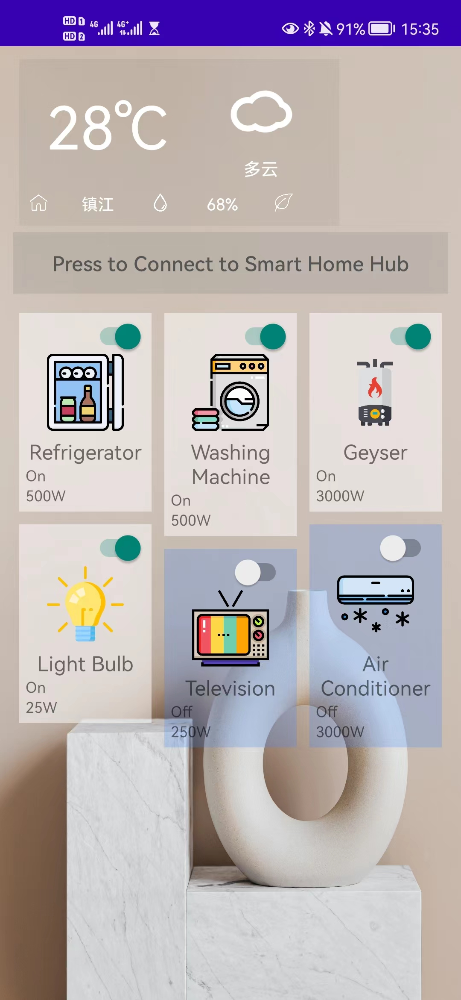
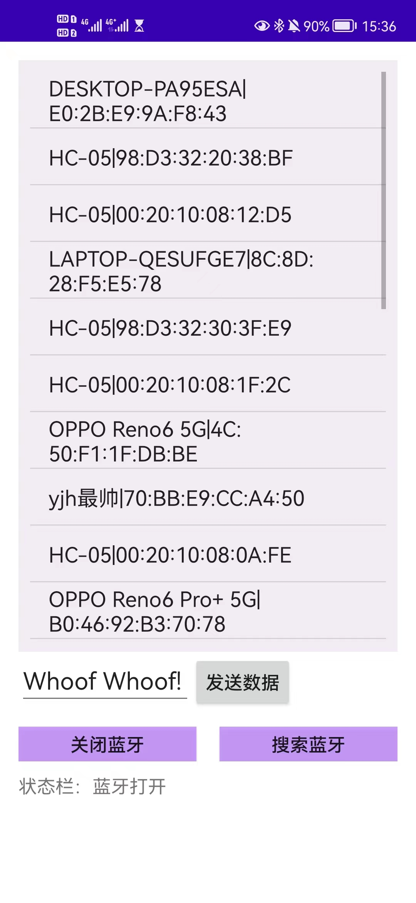
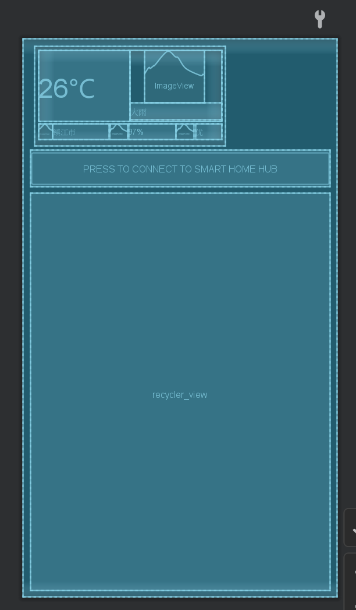
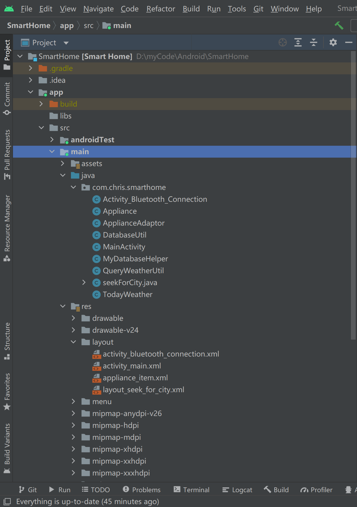

# Smart Home App based upon Android

> Didn't use the cooler slogan "Powered by Android" 'cause it requires Google's permission.

## 一、项目背景

• “智能家居”旨在使用信息技术连结家庭中的各个设备，提高管理效率。

•将Smart Home App安装在您的安卓手机上，和“智能家居管理中心”使用Bluetooth传输协议通讯，实时监测和管理家用设备。

## 二、效果实现

- 实时查询天气，并显示图片
- STM32单片机模拟Smart Home Hub，收发设备运行状态数据。
- 单片机上的灯的亮和灭来表示设备的开关

## 三、界面设计

界面架构：(一些LinearLayout 和 一堆view)

> 注： 突然发现寒假写的一些前端内容有点用了！至少对页面布局控制更加得心应手了。xml和html有点相同。哈哈哈突然发现我下次写.NET GUI的时候，是不是可以不用stick to WinForm了😋，可以用xml写WPF了！Hoooray!
>
> 又忍不住吐槽Android数据绑定不是很方便。（也许是我不学无术还没有学会...555）只能说Vue yyds！

## 四、程序结构

逻辑代码部分主要有9个`.java`文件。

> 下面容我娓娓道来🤗

### MainActivity.java

主页面的逻辑。

> 安卓里面每一个页面都是一个Activity

### seekForCity.java

搜索城市页面的逻辑。用SQL语言实现了对.db数据库的实时查询。（增删没实现）

没有设置查询按键。是输入框(`EditView`内容更改自动查询，也许效率太低，不过对于3000量级的小database而言，足矣)

> 我觉得可能祖国一时半会也不会对地级市进行增删吧🤔

`DatabaseUtil`就是`apk`内置数据库使用的一些前置操作。把包里面`\assets`文件夹下的`.db`移动到默认的数据库位置 `.\data\data\<package name>\*.db` 来源于CSDN。

### QueryWeatherUtil.java

类如其名，就是上网查询实时的天气。使用多线程+广播机制，不会让程序界面卡死。

里面的`ParseXML`类就是用来匹配查询到的数据的。可能要根据网站的变化而实时更新，app过了几天之后可能就不能用了。（网站对于XML的格式可能会做出调整）

### Activity_Bluetooth_Connection.java

蓝牙的搜索、连接的界面。实现的比较丑陋，以后可能做一些优化。

> 因为时间紧迫，直接拿了老师发的一小段代码过来，拼接的时候就直接把蓝牙通信进程静态化了。其实这种做法我认为挺丑陋的。但是旁边的同学(jhgg)觉得很妙，我也不知道究竟是好是坏。

搜索蓝牙的时候要开一堆权限。高API版本的时候要做一些额外的适配。（手动申请权限等等）

### ApplianceAdaptor.java

用于`RecyclerView`的适配器，电器卡片的内容安排就在这个类。电器卡片上的按钮点击事件也是在这个类里面绑定。`RecyclerView`这块参考的[郭霖](https://github.com/guolindev/)郭大佬的《Android第一行代码》（第二版）。

### Appliance.java

电器的类。

### TodayWeather.java

今日天气的类。

## 五、收获与感想

- 像我这种新手用一个好一点的IDE有时可以事半功倍。（为Android Studio以及它背后的IntelliJ IDEA打call!）
- 软件debug真的要死人。但是要学会看程序的debug输出。（比如这里的`Log.d()`)这是很重要的debug能力。一行一行去找输出栈，指导找到`Logcat`里面和自己程序有关的一项。
- 这两周代码写的我有点累。后面还有两周的Python。希望不要累瘫。

> 最后的话：
>
> 本实验原是清华大学电机系开设的《嵌入式系统实践》课程的大作业。
>
> 旨在于让嵌入式系统得到一些具体的实践。
>
> 虽然说一周时间学会Java和Android开发有难度，但我居然做了一点点东西出来。
>
> （甚至有点像模像样的
>
> 有点自我感动...（删除线）

> 在此开源
>
> 我原是喜欢开源的
>
> 要是东西好，好东西不拿出来分享，那不是可惜了吗
>
> 要是东西烂，烂东西不拿出来给各路武林高手斧正，那不是永无出头之日了吗
>
> (doge)